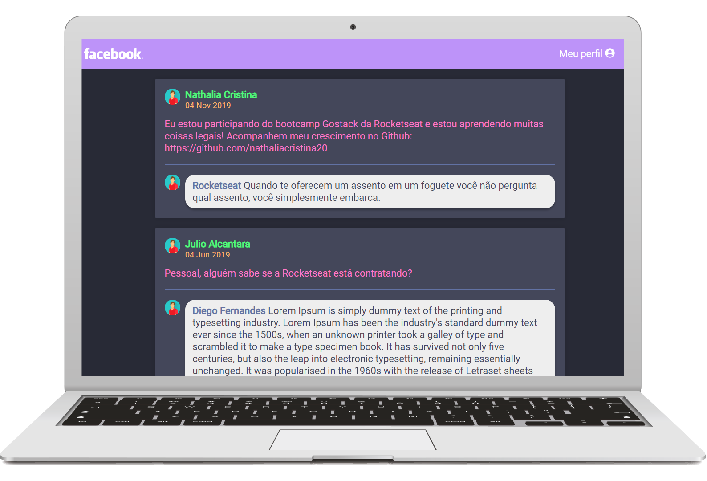

<h1 align="center">
 GitHub Explorer
</h1>

<p align="center">
  <a href="#rocket-sobre-o-projeto">Sobre o projeto</a> | <a href="#computer-tecnologias">Tecnologias</a> | <a href="#books-guia-de-instalação-e-execução">Guia de instalação e execução</a> | <a href="#scroll-licença">Licença</a>
</p>

## Layout


## :rocket: Sobre o projeto

<p>Desafio realizado durante a realização do Bootcamp GoStack da Rocketseat.</p>

<p>O desafio era criar uma tela estática inspirada no facebook do zero utilizando Webpack dev server, Babel e ReactJS.</p>

<p>E ainda, escolhi dar um toque pessoal ao desafio inserindo uma paleta de cores inspirada no tema Drácula famoso entre os desenvolvedores.</p>

## :computer: Tecnologias

- ReactJS
- Webpack
- Babel

## :books: Guia de instalação e execução

### Pré-requisitos

- Yarn ou npm

### Como executar

```bash
# Clone este repositório e acesse a pasta
git clone https://github.com/nathaliacristina20/bootcamp-gostack-facebook.git && cd bootcamp-gostack-facebook

# Instale as dependencias com yarn OU
yarn

# Instale as dependencias com npm
npm install

# Rode a aplicação com o comando de acordo com seu gerenciador de pacotes
yarn start

# OU
npm start

# Pronto, a aplicação está rodando! Acesse http://localhost:3000 no browser.
```

## :scroll: Licença

Esse projeto está sob a licença MIT. Veja o arquivo <a href="https://github.com/nathaliacristina20/bootcamp-gostack-facebook/blob/master/LICENSE">LICENSE</a> para mais detalhes.

<hr />
<p>by Nathalia Cristina :wave: <a href="https://linktr.ee/nathaliacristina20">Get in touch!</a></p>
